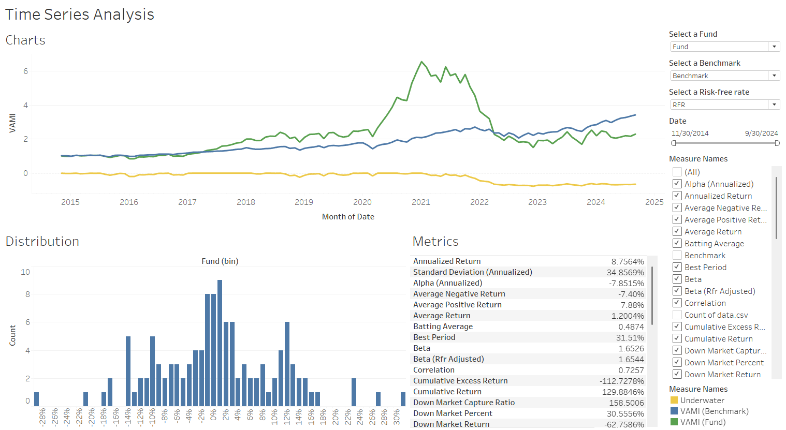
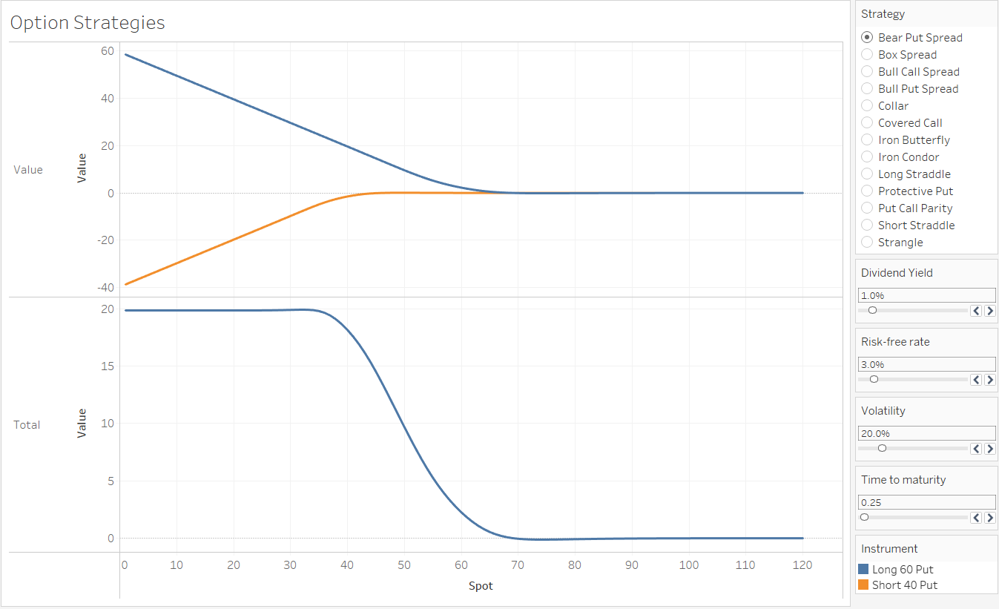

# Financial Toolkit in Tableau

This is a experimental repository for learning purposes.

## Project 1: Time Series Analysis

The dashboard displays performance and risk metrics, along with time series data for a selected fund and benchmark over a specified period. Users can adjust the time horizon, fund, benchmark, and risk-free rate.

## Project 2: Option Strategies

This worksheet presents the values of individual securities and the total payoffs of various option strategies. Theoretical option values are calculated using the Black-Scholes model.

